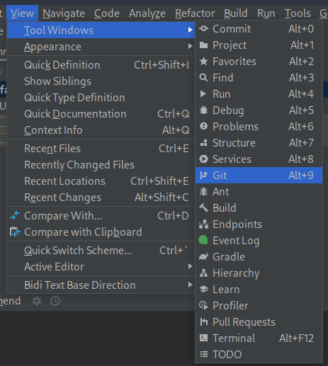
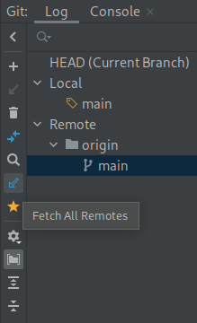
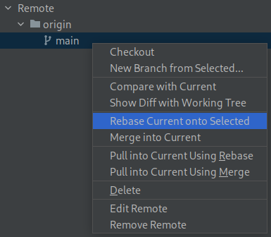

# Rebasing and Squashing
Before a feature will be merged, you should squash rebase the commits in its branch. "Squashing" means combining
separate commits into a single one. "Rebasing" means changing where a commit starts. For example, if you start working
on a feature, and then our repository updates afterwards, rebasing can make it so that all your progress started after
our repository's updates. For more information, read
[this article](https://www.atlassian.com/git/tutorials/rewriting-history/git-rebase).

## Using the Command Line
First, make sure you have committed all changes on the branch.

Next, run `git fetch <remote> main`. To find out what remote to use, run `git remote -v`. For example, if our repo is
under `origin`, you would run `git fetch origin main` (without the <>).

Next, run `git rebase -i --onto <remote>/main`. This should be the same remote as before. For example,
`git rebase -i --onto origin/main`. This starts the rebase.

Inside the text editor that opens, there should be a file that looks something like this:
```
pick aaaaaa My first commit
pick bbbbbb My second commit
pick cccccc My third commit
```

`pick` means the commit will be kept as-is. To squash two commits, place them on two adjacent lines and change the
second `pick` to `squash`. This can be done for as many commits as you'd like, but make sure to leave the topmost one
as `pick`.

After exiting the text editor, git may show you conflicts between your branch and `main`. This is OK; just go to the
files Git tells you have conflicts and decide how to combine them. Look for `<<<<<<<`, `=======` and `>>>>>>>`. On
either side of `=======` are the two versions of the file. Edit the file, make sure your feature still works, then run
`git rebase --continue`.

After fixing conflicts, or if there were no conflicts, the text editor will open again. This time, you should write
a combined commit message for the commits you squashed together. The original commits will be shown in a comment
(starting with #) under "Last commands done". Don't just leave the commit message as the two original messages, and
make sure the combined summary (first line) still follows
[Conventional Commits](https://www.conventionalcommits.org/en/v1.0.0/)! 

This cycle may continue a few times, depending on whether there are more conflicts or commits to squash. Don't worry,
just keep following the guide as above until eventually the rebase is successful. If this repeats too many times, you
may want to consider squashing more commits together.

Finally, make sure your feature still works! If not, fix any issues and squash again. Then, push your branch and open a Pull
Request! You may have to force push -- this is OK! This is a temporary feature branch, only used by you. After the
Pull Request is merged, delete the branch, create a new one for another feature, and do it all once more!

## Using IntelliJ IDEA
First, make sure you have committed all changes on the branch.

Next, open the Git panel. This is under "View", then "Tool Windows", then "Git".



Next, Click the "Fetch All Remotes" button on the left side:



Next, select the commits you want to squash, right click, and choose "Squash Commits...". Type the combined commit
message here. Don't just leave the commit message as the two original messages, and make sure the combined summary
(first line) still follows [Conventional Commits](https://www.conventionalcommits.org/en/v1.0.0/)!

After you've squashed all the commits you want to, right click "main" under "origin" and choose "Rebase Current onto
Selected":



If there are conflicts, IDEA will tell you where they are. Either use IDEA's conflict editor to resolve these, or
edit the files normally. Afterwards, continue the rebase using the popup in the bottom right, or the bottom panel.

Finally make sure your feature still works! If not, fix any issues and squash again. Then, push your branch and open a Pull
Request! You may have to force push -- this is OK! This is a temporary feature branch, only used by you. After the
Pull Request is merged, delete the branch, create a new one for another feature, and do it all once more!
